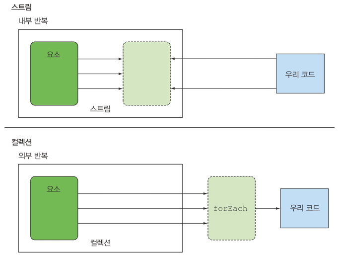

# java-stream
레드블루 java stream 스터디자료

## 시나리오
프록시 패턴을 사용하여 성능측정해보기

## 메모
자바 7에서는 더 쉽게 병렬화를 수행하면서 에러를 최소화 할 수 있도록 포크/조인 프레임워크를 제공

병렬스트림은 내부적으로 ForkJoinPool을 사용한다. -> 기본적으로 ForkJoinPool은 Runtime.getRuntime().availableProcessor()에 반환되는 값에 상응하는 스레를 갖는다.

성능을 최적화할 때 세가지 규칙 기억
첫째도 측정, 둘째도 측정, 셋째도 측정

자바 마이크로벤치마크 하니스(Java MicrobenchMark Harness)

stack overflow error -> 발생원인 조사

high level building block -> 특정 스레드 모델에 제한되지 않고 자유롭게 어떤 상황에서든 사용 가능
1. 데이터 처리과정에서 병렬화하면서 스레드와 락을 걱정할 필요가 없음 (스트림 API 덕분)

컬렉션을 제어하는 라이브러리
1. guava
2. Multimap
3. Multiset

스트림이란
데이터 처리 연산을 지원하도록 소스에서 추출된 연속된 요소 -> 컬렉션과 마찬가지로 특정 요소 형식으로 이루어진 연속된 값의 집합이다.
컬렉션은 현재 자료구조가 포함하는 모든값을 메모리에 저장하는 자료구조이다. -> 즉 컬렉션의 모든 요소는 컬렉션에 추가하기 전에 계산되어야 한다.
스트림은 이론적으로 요청할때만 요소를 계산하는 고정된 자료구조이다. -> 생산자(producer)와 소비자(consumer) 관계를 형성한다.
또한 스트림은 게으르게 만들어지는 컬렉션과 같은데, 사용자가 데이터를 요청할 때만 계산한다.(경영학에서는 이를 요청 중심 제조라 한다.)
컬렉션은 적극적으로 생성된다.(팔기도 전에 창고를 가득 채움)
탐색된 스트림의 요소는 소비되고, 탐색한 요소를 다시 탐색하려면 초기 데이터 소스에서 새로운 스트림을 만들어야 한다.

스트림 라이브러리의 내부 반복은 데이터 표현과 하드웨어를 활용한 병렬성 구현을 자동으로 선택한다.
for-each를 이용하는 외부 반복에서는 병렬성을 스스로 관리해야 한다.

스트림 특징
1. 선언형: 더 간결하고 가독성이 좋아짐
2. 조립할 수 있음: 유연성이 좋아진다.
3. 병렬화: 성능이 좋아진다.
4. 파이프라이닝(pipelining): 스트림 연산끼리 연결해서 커다란 파이프라인을 구성함
   * 쇼트서킷(short-circuiting): 쇼트 서킷에서는 &&  앞의 boolean 값이 false 일 때, && 뒤를 굳이 실행하지 않음으로 불필요한 연산을 생략
   * 게으름(laziness): 스트림의 요소는 요청할 때 게으르게 계산된다.
5. 내부 반복
6. filter와 map은 서로 다른연산이지만 한 과정으로 병합할 수 있음 -> loop fusion

스트림 활용
1. 필터링: filter메서드는 프레디케이트(boolean을 반환하는 함수)

스트림 기능
1. 필터링
2. 슬라이싱
3. 검색
4. 매칭
5. 매핑
6. 리듀싱

## 문제 원인
### JDK14LoggerAdapter recursive 호출로 인한 stack overflow 발생